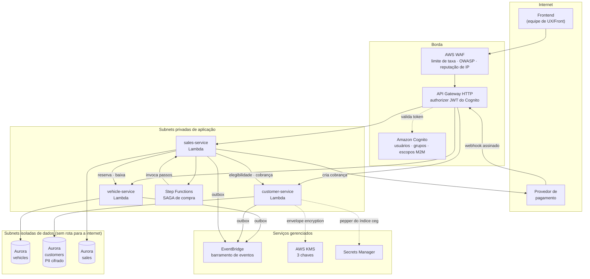
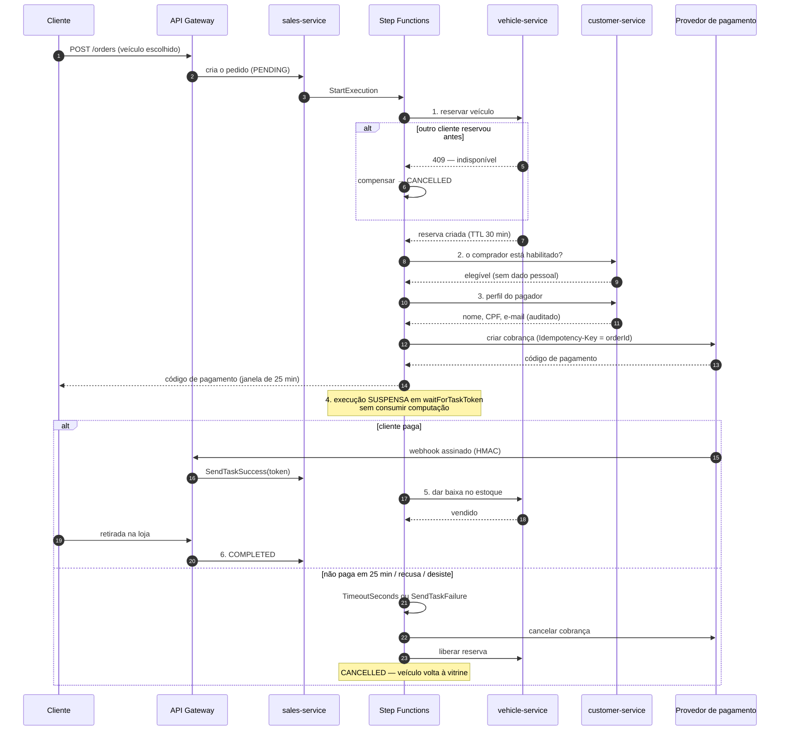
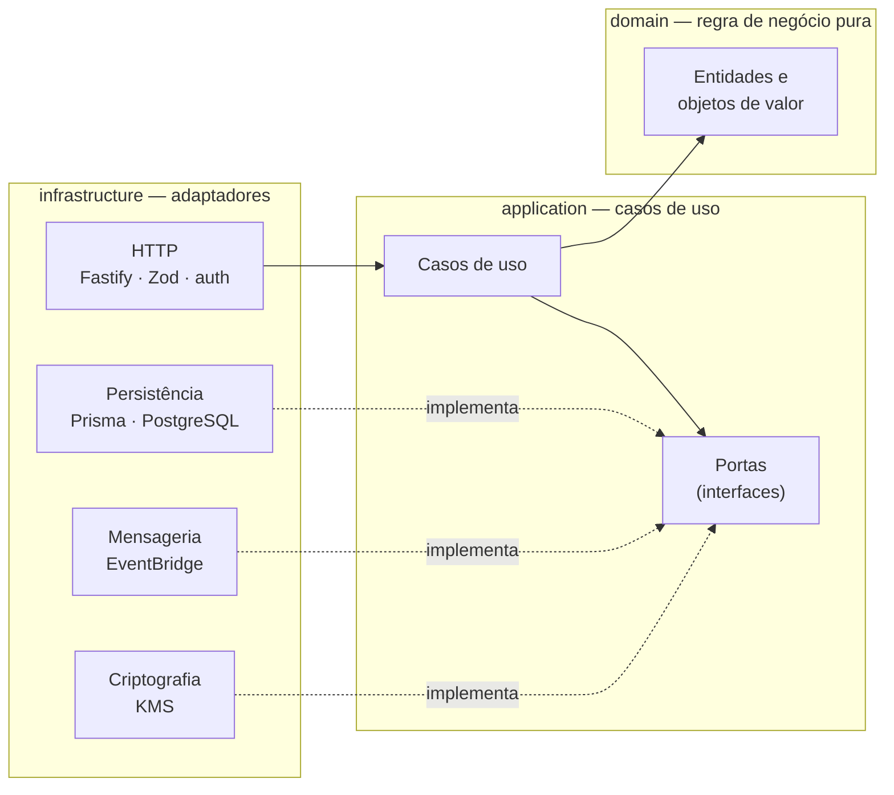
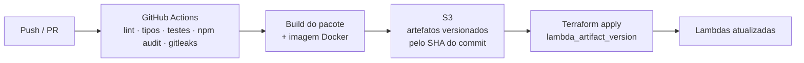

# Desenho da arquitetura

Plataforma de revenda de veículos — Tech Challenge Fase 5

---

## 1. Visão geral

A solução é composta por **três microsserviços autônomos**, cada um dono do seu
próprio banco de dados, comunicando-se por API síncrona (quando há dependência
de resposta) e por eventos assíncronos (quando há apenas notificação de fato
consumado).

### Os três serviços

| Serviço | Responsabilidade | Dado pessoal |
|---|---|---|
| **vehicle-service** | Catálogo e estoque. Cadastro, edição, vitrine ordenada por preço, reserva, liberação e baixa | Nenhum |
| **customer-service** | Cadastro de compradores, consentimento, direitos do titular. Fonte dos dados para o código de pagamento e para a documentação do veículo | **Todo** |
| **sales-service** | Processo de compra ponta a ponta. Orquestra a SAGA e executa as compensações | Nenhum armazenado |

A concentração de **todo** o dado pessoal em um único serviço é uma decisão
deliberada: reduz a superfície a proteger de três sistemas para um. Um
comprometimento do catálogo ou do serviço de vendas não expõe nenhum titular,
porque eles conhecem apenas um UUID opaco.

---

## 2. Serviços da nuvem escolhidos e por quê

O enunciado pede prioridade a serviços *serverless* e gerenciados. A tabela
abaixo traz a escolha, a alternativa considerada e o motivo da decisão.

### 2.1 Computação

| Escolha | Alternativa | Por que a escolha |
|---|---|---|
| **AWS Lambda** (Node 20, ARM64) | ECS Fargate | O tráfego de uma revenda é irregular e concentrado em horário comercial. Com Fargate, paga-se a tarefa rodando 24 h para atender um pico de poucas horas. A Lambda cobra por invocação e escala do zero. ARM64 (Graviton) custa cerca de 20% menos com o mesmo desempenho neste perfil de carga. |

O código é escrito em **arquitetura hexagonal**: a Lambda é apenas um adaptador
de entrada (`src/lambda-api.ts`). Cada serviço mantém um `Dockerfile`
funcional — se o perfil de tráfego mudar e Fargate passar a compensar, a
migração não toca em nenhuma regra de negócio.

### 2.2 Dados

| Escolha | Alternativa | Por que a escolha |
|---|---|---|
| **Aurora PostgreSQL Serverless v2** | DynamoDB | O requisito central do catálogo é **ordenar e filtrar por faixa de preço sobre todo o estoque**. Em SQL isso é um índice composto (`status`, `price_in_cents`); em DynamoDB exigiria partição sintética, GSI e paginação frágil. Os outros dois serviços dependem de transação ACID: a trilha de auditoria precisa ser gravada no **mesmo commit** da operação auditada, e o outbox no mesmo commit da mudança de estado. |
| | Aurora Serverless v1 | A v1 pausava e voltava com cold start de minutos. A v2 escala em segundos dentro de uma faixa declarada e mantém o piso de 0,5 ACU quente. |
| **RDS Proxy** | conexão direta | É o que torna Lambda + banco relacional viável. Cada execução concorrente abriria a própria conexão; um pico de 500 execuções esgotaria o limite do Aurora. O Proxy multiplexa conexões efêmeras em poucas reais e, durante um failover, segura as conexões do cliente — transformando minutos de erro em segundos de latência. |

**Um cluster por serviço** (*database-per-service*). Custa mais e é pago
conscientemente: com Serverless v2 no piso, o gasto em repouso é baixo, e em
troca nenhum serviço alcança as tabelas de outro. Sem isso, "microsserviços"
seria só um monolito distribuído com a pior parte dos dois modelos.

### 2.3 Integração

| Escolha | Alternativa | Por que a escolha |
|---|---|---|
| **Amazon EventBridge** | SNS + SQS direto | O roteamento fica declarado em **regras na infraestrutura**, não no código do produtor. Adicionar um consumidor de `vehicle.sold` — notificação, data lake, BI — é criar uma regra, sem tocar no vehicle-service. É o que mantém baixo o acoplamento. |
| **EventBridge Scheduler** | regra `rate()` | Tem janela de tolerância, fuso horário e limite de repetição por invocação, e não fica preso ao barramento de eventos. |
| **AWS Step Functions** | orquestração no código | Ver o relatório de SAGA (documento 3). |

Todos os consumidores têm **DLQ**. Sem ela, um evento que falha repetidamente é
descartado em silêncio, e a inconsistência aparece semanas depois num relatório
que não fecha.

### 2.4 Borda

| Escolha | Alternativa | Por que a escolha |
|---|---|---|
| **API Gateway HTTP API** | REST API | Custa cerca de um terço, tem latência menor e traz o authorizer JWT nativo. Os recursos exclusivos do REST API (modelos, planos de uso, chaves de API) não são necessários: a validação de payload é feita por schema Zod dentro do serviço, e o controle de taxa fica no WAF e no throttling do stage. |

---

## 3. Serviços de segurança e a justificativa de cada um

Esta seção atende ao item "utilize serviços de segurança disponibilizados pela
nuvem e justifique o motivo do seu uso". Cada serviço responde a uma **ameaça
concreta**, descrita junto.

| Serviço | Ameaça que endereça | Como é usado aqui |
|---|---|---|
| **Amazon Cognito** | Autenticação própria mal feita: senha em texto claro, ausência de MFA, sessão que não expira, reset de senha vulnerável | User pool com senha de 12+ caracteres, MFA por TOTP, *advanced security* (detecta credencial vazada e *credential stuffing*), token de acesso de 1 h e `prevent_user_existence_errors` para não revelar se um e-mail está cadastrado. Grupos `admin`, `support` e `customer` viram as `cognito:groups` do token. |
| **Cognito resource server (escopos)** | Um serviço comprometido acessar tudo | Escopos granulares por operação: `vehicles.reserve`, `vehicles.sell`, `customers.eligibility`, `customers.billing`, `customers.documentation`. O sales-service consulta elegibilidade **sem** poder puxar o perfil de cobrança com o mesmo token. |
| **AWS KMS** | Vazamento de dump do banco expondo CPF, endereço e documento | Três chaves gerenciadas pelo cliente (CMK), uma por finalidade: dados pessoais, bancos e logs. Chaves separadas porque a política de cada uma define quem pode usá-la — com uma chave só, quem decifrasse log decifraria CPF. Rotação automática anual. A chave de PII exige **contexto de criptografia** (`customerId` + campo): mover o CPF cifrado de um titular para a linha de outro quebra a decifragem. |
| **AWS Secrets Manager** | Segredo em variável de ambiente da Lambda, visível em `GetFunctionConfiguration` e em despejos de diagnóstico | Guarda o *pepper* do índice cego de CPF, o segredo HMAC do webhook e as credenciais M2M. Valor cifrado com KMS, cada leitura registrada no CloudTrail, rotação suportada. |
| **AWS WAF** | Enumeração de CPF pelo cadastro público, varredura do catálogo, injeção, tráfego de botnet | Cinco regras no API Gateway: limite de 2 000 req/5 min por IP; limite muito mais apertado (100) só em `/customers`; `AWSManagedRulesCommonRuleSet`; `KnownBadInputs`; `IpReputationList`. Requisição bloqueada no WAF **não gera invocação de Lambda nem conexão de banco** — é defesa e controle de custo. |
| **Amazon GuardDuty** | Credencial comprometida usada de forma anômala; exfiltração; comunicação com infraestrutura maliciosa | Analisa CloudTrail, VPC Flow Logs e DNS com inteligência de ameaças e aprendizado de máquina. Detecta o que nenhuma regra escrita à mão cobriria. Achados de severidade ≥ 7 vão direto para o SNS de plantão. |
| **AWS Security Hub** | Desvio de configuração acumulado ao longo do tempo | Consolida achados de GuardDuty, Config e Inspector e mede conformidade contra o CIS Benchmark e as AWS Foundational Security Best Practices. É o painel único de postura. |
| **AWS CloudTrail** | Acesso a dado pessoal sem rastro; apagamento de evidência | Trilha multi-região com validação de integridade (resumo assinado detecta remoção ou alteração de arquivos). Registra **cada `kms:Decrypt`** — permite responder, depois do fato, quem decifrou dado pessoal e quando, mesmo que o atacante tenha comprometido a aplicação. O bucket tem versionamento e política que **nega** `s3:DeleteObject` a todos. |
| **VPC Flow Logs** | Investigação forense sem registro de rede | Responde "que tráfego saiu desta Lambda" durante um incidente. |
| **VPC endpoints** | Chamadas de decifragem trafegando pela internet pública | KMS, Secrets Manager, EventBridge, Step Functions, Logs, X-Ray e SQS por endpoint de interface; S3 por gateway. O tráfego nunca deixa a rede da AWS. |
| **IAM (papel por serviço)** | Comprometimento de um serviço virar acesso total | Um papel de execução por serviço, com permissões escritas caso a caso. O papel do vehicle-service **não tem** `kms:Decrypt` na chave de PII; o do customer-service **não pode** iniciar execuções da SAGA. |
| **Security groups em três camadas** | Movimentação lateral | Um SG por serviço. O banco de clientes só aceita conexão do RDS Proxy, que só aceita conexão das Lambdas do customer-service. As subnets de dados **não têm rota para a internet, nem de saída**. |

---

## 4. Fluxo de uma compra

**Por que a janela de pagamento (25 min) é menor que o TTL da reserva (30 min):**
se fosse maior, o veículo voltaria sozinho à vitrine enquanto o pedido ainda
aceitasse pagamento — e dois compradores poderiam pagar pelo mesmo carro. A
invariante é verificada na inicialização do sales-service, que **se recusa a
subir** se for violada.

---

## 5. Arquitetura interna dos serviços

Todos os três seguem **arquitetura hexagonal** (ports & adapters), com as
dependências sempre apontando para dentro:

O `domain` não importa Prisma, Fastify nem AWS SDK. É por isso que os testes de
regra de negócio rodam em menos de um segundo, sem banco e sem nuvem — e é o que
permite trocar EventBridge por outro barramento, ou KMS por outro provedor de
chaves, sem tocar em nenhuma regra.

### Padrões aplicados

| Padrão | Onde | Problema que resolve |
|---|---|---|
| **Transactional Outbox** | Todos os três | Mudança de estado e publicação de evento são escritas em sistemas diferentes. Gravar o evento na mesma transação elimina a janela em que o estoque muda sem ninguém ser avisado. |
| **Trava otimista** | Todos os três | Disputa de estoque sem lock pessimista — que, em serverless, manteria transação aberta esperando I/O e consumiria conexão do pool. |
| **Índice cego** | customer-service | Busca exata e unicidade por CPF sem armazenar nem decifrar o valor. |
| **Envelope encryption** | customer-service | Criptografia em nível de campo com uma chamada ao KMS por operação, em vez de uma por campo. |
| **SAGA orquestrada** | sales-service | Consistência entre três serviços sem transação distribuída. |
| **Idempotência em todo passo** | sales-service | Retry do orquestrador e reentrega de webhook não duplicam efeito. |

---

## 6. Fluxo de implantação

Cada serviço tem o próprio *pipeline* e implanta de forma independente — é o
requisito mínimo para que "microsserviço" signifique alguma coisa. O CI do
sales-service **também valida a definição da SAGA**: um JSON malformado só
apareceria no `terraform apply`, e o deploy inteiro falharia.

---

## 7. Resiliência

| Mecanismo | O que garante |
|---|---|
| Multi-AZ (2 zonas) | A perda de uma zona não derruba a plataforma |
| Um NAT por zona | A perda de uma zona não derruba a saída de internet das demais |
| RDS Proxy | Failover em segundos em vez de minutos de erro |
| Concorrência reservada nas Lambdas | Um pico não esgota o pool do banco e derruba o que funcionava |
| Retry com backoff e jitter | Falha transitória não vira falha de negócio; e as execuções não voltam todas juntas |
| Compensação idempotente | A compensação pode ser repetida com segurança — e ela também falha às vezes |
| Expiração de reservas (1 min) | Mesmo que a SAGA morra no meio, o veículo sempre volta à vitrine |
| Reconciliação de pagamentos (1 min) | Um webhook perdido não custa a venda a um cliente que pagou |
| Outbox + DLQ | Nenhum evento é perdido em silêncio |
