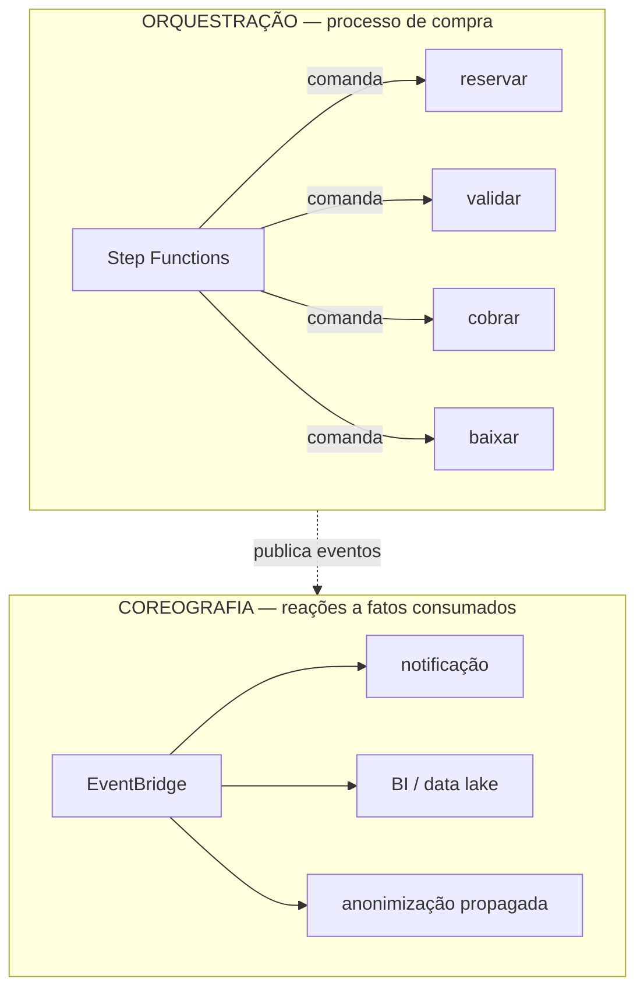
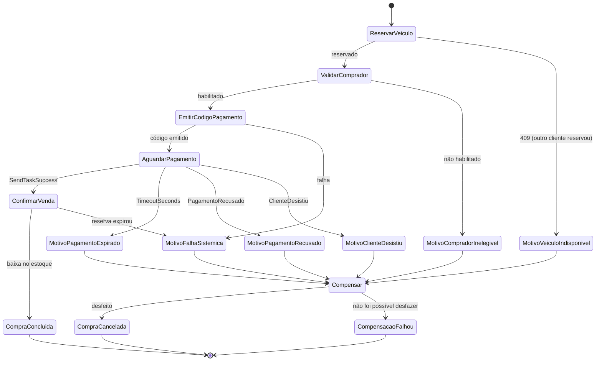

# Relatório de orquestração SAGA

Plataforma de revenda de veículos — Tech Challenge Fase 5

---

## 1. Resposta direta

**Tipo escolhido: SAGA com orquestração**, implementada com **AWS Step
Functions**.

A coreografia foi considerada e descartada. A justificativa está na seção 4; as
seções 2 e 3 estabelecem o que precisa ser justificado.

---

## 2. Por que existe uma SAGA neste problema

O processo de compra atravessa **três serviços com bancos de dados separados**:

```
sales-service          vehicle-service         customer-service
(pedido)               (estoque)               (cadastro)
     │                      │                        │
     └──── precisa que ─────┴──── e que ─────────────┘
           a reserva            o comprador
           exista               esteja habilitado
```

Uma transação ACID resolveria isso em um banco único. Aqui ela não existe, e as
duas alternativas clássicas não servem:

| Alternativa | Por que não |
|---|---|
| **Transação distribuída (2PC)** | Exige que todos os participantes suportem o protocolo. Nem o provedor de pagamento nem as APIs HTTP suportam. Pior: o 2PC é **bloqueante** — o coordenador segura locks em todos os participantes até a decisão final. O passo de pagamento espera **até 25 minutos** pela ação de um ser humano; manter o estoque travado por 25 minutos sob lock de banco esgotaria o pool de conexões e derrubaria a plataforma. |
| **Banco compartilhado entre os serviços** | Elimina a autonomia que motiva a separação. Passa a exigir migração coordenada e transforma qualquer comprometimento de um serviço em acesso a todos os dados — inclusive aos pessoais. |

Sobra a **SAGA**: uma sequência de transações locais, cada uma com uma
**transação compensatória** que desfaz o seu efeito. A consistência deixa de ser
imediata e passa a ser *eventual*, mas nunca é abandonada: ou a compra se
completa, ou tudo o que ela produziu é desfeito.

### Os passos e suas compensações

| # | Passo | Serviço | Compensação | Idempotente por |
|---|---|---|---|---|
| 1 | Reservar veículo | vehicle-service | Liberar reserva | `orderId` |
| 2 | Validar comprador | customer-service | — (só leitura) | — |
| 3 | Emitir código de pagamento | customer-service + provedor | Cancelar cobrança | `Idempotency-Key = orderId` |
| 4 | Aguardar pagamento | — (espera por callback) | — | estado do pedido |
| 5 | Dar baixa no estoque | vehicle-service | Estornar (fora da SAGA) | `orderId` |
| 6 | Retirada do veículo | sales-service | — (terminal) | `deliveredAt` |

O passo 2 não tem compensação porque é apenas leitura — não produz efeito a
desfazer. O passo 5 é o **ponto de não retorno**: depois dele, desfazer a venda
deixa de ser uma compensação técnica e passa a ser um processo de negócio
(arrependimento, garantia), com regras e prazos próprios.

### Por que reservar o veículo é o passo 1

É o recurso **escasso e disputado**. Falhar ali custa barato: nada foi feito
ainda e não há o que compensar.

Se a validação do comprador viesse antes, uma disputa perdida jogaria fora o
trabalho já realizado e — mais grave — ampliaria a janela em que outro cliente
poderia levar o carro. A regra geral: **adquira o recurso contestado o mais cedo
possível; adie o que é caro e não disputado.**

---

## 3. Orquestração × coreografia

| | Orquestração | Coreografia |
|---|---|---|
| **Quem decide o próximo passo** | Um coordenador central | Cada serviço, ao reagir a um evento |
| **Onde vive o fluxo** | Declarado em um lugar | Emerge da soma dos consumidores |
| **Compensação** | O coordenador sabe o que desfazer | Cada serviço precisa saber compensar por conta própria |
| **Acoplamento** | Ao coordenador | Ao formato dos eventos |
| **Visibilidade** | Estado consultável da execução | Reconstruída a partir de logs |
| **Ponto único de falha** | O coordenador | Não há |

---

## 4. Por que orquestração, neste caso

Cinco razões, da mais decisiva para a menos.

### 4.1 A compensação precisa ser explícita e ordenada

Quando o pagamento falha, é preciso **cancelar a cobrança e liberar a reserva,
nessa ordem** — e garantir que ambos aconteceram.

Na coreografia, isso seria uma cadeia de eventos: `payment.failed` → o
vehicle-service escuta e libera → publica `vehicle.released`. Mas:

- **quem garante que a liberação aconteceu?** Se o vehicle-service estiver
  indisponível, o evento vai para a DLQ e o veículo fica preso fora do estoque —
  sem que ninguém detenha a responsabilidade de verificar;
- **quem sabe que a compensação está incompleta?** Ninguém tem a visão do todo.
  A inconsistência só aparece depois, quando alguém reclama de um carro que
  sumiu da vitrine.

Na orquestração, a compensação é um **estado da máquina**, com política própria
de retry (6 tentativas, backoff exponencial com jitter) e um estado terminal
`CompensacaoFalhou` que **dispara o alarme mais crítico da plataforma**.

### 4.2 O processo tem timeout de negócio, não só técnico

"O cliente tem 25 minutos para pagar" é uma regra de negócio. Em coreografia,
implementá-la exige um serviço com relógio próprio varrendo pedidos pendentes —
um componente inventado para suprir a ausência de coordenador.

No Step Functions é uma linha:

```json
"AguardarPagamento": {
  "Resource": "arn:aws:states:::lambda:invoke.waitForTaskToken",
  "TimeoutSeconds": 1500,
  "Catch": [{ "ErrorEquals": ["States.Timeout"], "Next": "MotivoPagamentoExpirado" }]
}
```

E, crucialmente: durante esses 25 minutos **a execução fica suspensa sem
consumir computação**. Não há processo vivo, não há Lambda rodando, não há
polling. O custo da espera é zero.

### 4.3 Há um ponto de espera por evento externo

O pagamento chega por **webhook**, quando o cliente decide pagar — pode ser em 30
segundos ou em 20 minutos. Isso exige um mecanismo de retomada de execução
suspensa.

O `waitForTaskToken` é exatamente isso: o Step Functions entrega um token à
Lambda, que o grava no pedido; a execução para; o webhook devolve o token com
`SendTaskSuccess` (pagou) ou `SendTaskFailure` (recusou/desistiu) e a execução
retoma do ponto exato.

O token é guardado **no banco**, não em memória — a Lambda que o recebeu morre em
seguida, e o webhook pode chegar em outra instância, horas depois. E é consumido
**uma única vez**, dentro de uma transação com trava otimista: dois webhooks
concorrentes não disparam dois callbacks para a mesma execução.

Em coreografia isso não tem equivalente natural. Seria preciso construir uma
máquina de estados manual no banco do sales-service — ou seja, **implementar um
orquestrador pior**, sem histórico, sem retry declarativo e sem visibilidade.

### 4.4 Operação: responder "por que esta compra falhou"

Numa revenda, essa pergunta é feita pelo cliente ao telefone, e a resposta
precisa vir em segundos.

Com orquestração, o histórico da execução mostra cada passo, a entrada, a saída,
o erro e a decisão de compensar — em uma tela. Com coreografia, seria preciso
correlacionar logs de três serviços e do barramento, torcendo para que o
`correlationId` tenha sido propagado corretamente em todos eles.

A plataforma tem `correlationId` ponta a ponta justamente porque essa
correlação é necessária de qualquer forma — mas com o orquestrador ela deixa de
ser o **único** recurso disponível.

### 4.5 O fluxo é linear e estável

O processo de compra tem uma sequência definida, que muda pouco. Coreografia
compensa quando o fluxo é genuinamente reativo — muitos consumidores
independentes reagindo ao mesmo fato, cada um com o próprio ciclo de vida. Não
é o caso: os passos aqui têm ordem, e a ordem importa.

### O que se aceita ao escolher orquestração

Seria desonesto apresentar a decisão sem o custo.

| Contrapartida | Como é mitigada |
|---|---|
| O orquestrador é um ponto central de falha | Step Functions é um serviço gerenciado com SLA da AWS; não é um componente que a equipe opera |
| Acoplamento dos serviços ao coordenador | Os passos são **endpoints HTTP comuns**, sem nada específico de Step Functions. O mesmo `PurchaseSagaSteps` roda sob o orquestrador em processo — a prova de que não há acoplamento é que os testes exercitam a orquestração sem AWS |
| Risco de o orquestrador virar "deus" com regra de negócio | A ASL contém **apenas coordenação**: ordem, retry, timeout e rota de compensação. Nenhuma regra de negócio. O que decide se um comprador pode comprar é o `customer-service`, não o JSON |
| Custo por transição de estado | Na ordem de centavos por milhar de execuções — irrelevante frente ao ticket de um veículo |

---

## 5. Onde a coreografia **é** usada

A decisão não é binária. A plataforma usa **os dois modelos**, cada um onde
cabe:



| Fluxo | Modelo | Por quê |
|---|---|---|
| Processo de compra | **Orquestração** | Compensação, timeout e espera por callback |
| `customer.anonymized` → demais serviços descartam dado derivado | **Coreografia** | Notificação de fato consumado; não há o que compensar |
| `vehicle.sold` → BI, notificação, data lake | **Coreografia** | Consumidores independentes, cada um com seu ciclo |
| `order.completed` → pesquisa de satisfação | **Coreografia** | Acessório ao processo; sua falha não afeta a venda |

O critério: **orquestração quando há efeito a desfazer; coreografia quando o
fato já é definitivo.**

---

## 6. A máquina de estados

Definição completa em
[`sales-service/infra/statemachine/purchase-saga.asl.json`](../sales-service/infra/statemachine/purchase-saga.asl.json)
— 15 estados, validada no CI.



Note que `CompraCancelada` é um estado **`Succeed`**, não `Fail`. Uma compra que
não se concretizou mas foi desfeita corretamente é um **sucesso do ponto de
vista da consistência** — o veículo voltou à vitrine e a cobrança foi cancelada.
O único `Fail` da máquina é `CompensacaoFalhou`, e é ele que separa "não vendemos
hoje" de "temos um problema".

### Estados intermediários de motivo

Cada `Catch` aponta para um estado `Pass` que apenas grava o motivo antes de
convergir para `Compensar`:

```json
"MotivoVeiculoIndisponivel": {
  "Type": "Pass",
  "Result": "VEHICLE_UNAVAILABLE",
  "ResultPath": "$.reason",
  "Next": "Compensar"
}
```

Parece verboso, e é deliberado: torna o motivo do cancelamento **visível no
diagrama** do console e gravável no pedido sem lógica condicional dentro da
Lambda de compensação. É o que permite responder ao cliente "seu pedido foi
cancelado porque outro comprador reservou o veículo antes" em vez de "houve uma
falha".

---

## 7. Tipo de execução: Standard, não Express

| | Standard | Express |
|---|---|---|
| Duração máxima | 1 ano | 5 minutos |
| Histórico | Completo, consultável | Só no CloudWatch Logs |
| Semântica | Exactly-once | At-least-once |
| Custo | Por transição | Por duração e memória |

A execução dura **até 25 minutos** — muito além do limite do Express. E o
histórico completo é o instrumento de diagnóstico descrito em 4.4. Em volume
baixo (uma revenda, não um marketplace), o custo por transição é irrelevante.

---

## 8. Idempotência: o requisito que sustenta tudo

Um orquestrador **reexecuta passos**. Após timeout de rede, o Step Functions
tenta de novo sem saber se a chamada anterior chegou a produzir efeito. Se os
passos não forem idempotentes, o retry duplica reservas e cobranças.

| Passo | Mecanismo |
|---|---|
| Reservar veículo | `Vehicle.reserve` devolve a reserva existente se o `orderId` for o mesmo |
| Emitir cobrança | `Idempotency-Key = orderId`; o provedor devolve a mesma cobrança |
| Confirmar pagamento | `Order.markPaid` retorna sem efeito se já pago |
| Baixa no estoque | O passo nem chama o parceiro se o pedido já está `SALE_CONFIRMED` |
| Compensar | Cancelar cobrança e liberar reserva são idempotentes nos parceiros; liberar um veículo já disponível não é erro |

Há teste automatizado para cada uma dessas propriedades.

### Retry: só o que é transitório

Distinguir falha transitória de definitiva é o que evita que um retry inútil
consuma a janela de pagamento:

| Falha | Retentável? | Por quê |
|---|---|---|
| 5xx, 429, timeout de rede | **Sim** | O parceiro pode se recuperar |
| 409 "veículo já reservado" | **Não** | Outro cliente levou o carro. Insistir não muda isso |
| 403 "comprador não habilitado" | **Não** | Decisão de negócio |
| Falha na compensação | **Sim, agressivamente** | 6 tentativas: não desfazer é pior que insistir |

O backoff é exponencial **com jitter** (`"JitterStrategy": "FULL"`). Sem o
componente aleatório, todas as execuções que falharam juntas voltariam juntas e
repetiriam a sobrecarga que causou a falha.

---

## 9. As três redes de segurança

Um orquestrador não é infalível. A plataforma tem três mecanismos independentes:

### 9.1 Expiração de reservas (vehicle-service, a cada minuto)

Devolve à vitrine qualquer reserva vencida, **independentemente da SAGA**. Se
uma execução morreu entre reservar e compensar, esta varredura conserta.

É o que torna o TTL da reserva a **garantia final de liveness**: o veículo sempre
volta ao estoque, aconteça o que acontecer com o orquestrador.

### 9.2 Reconciliação de pagamentos (sales-service, a cada minuto)

Antes de compensar um pedido vencido, **consulta ativamente o provedor**. Se a
cobrança está paga, o cliente pagou e o webhook se perdeu — nesse caso a venda é
concluída, não cancelada.

Sem isso, um webhook perdido custaria a venda a um cliente que pagou corretamente
e ainda geraria uma cobrança a estornar. Essa conferência é o que transforma o
webhook em **otimização de latência** em vez de ponto único de falha.

### 9.3 Transactional Outbox (os três serviços)

Mudança de estado e publicação de evento são escritas em sistemas diferentes.
Gravar o evento na **mesma transação** da mudança de estado elimina a janela em
que o estoque muda sem ninguém ser avisado.

Entrega é *at-least-once* — por isso todo consumidor deduplica por `eventId`.

---

## 10. A invariante que amarra os dois serviços

```
PAYMENT_WINDOW_MINUTES (25)  <  RESERVATION_TTL_MINUTES (30)
```

Se a janela de pagamento fosse **maior** que o TTL da reserva, o veículo voltaria
sozinho à vitrine enquanto o pedido ainda aceitasse pagamento — e **dois
compradores poderiam pagar pelo mesmo carro**.

A verificação é feita na inicialização do sales-service, e o serviço **se recusa
a subir** se for violada. Uma invariante distribuída que existe apenas na
documentação é uma invariante que será quebrada.

---

## 11. Os cenários do enunciado

| Cenário do enunciado | Onde é tratado | Resultado |
|---|---|---|
| "Outro cliente reserva o veículo antes" | Passo 1 recebe 409 não-retentável | Pedido `CANCELLED` com motivo `VEHICLE_UNAVAILABLE`. **Nenhuma cobrança é emitida** |
| "O pagamento não é efetuado" | `TimeoutSeconds` do `AguardarPagamento` | Compensação: cobrança cancelada, veículo de volta à vitrine |
| "O cliente desiste em qualquer um dos passos" | `POST /orders/:id/cancellation` → `SendTaskFailure("ClienteDesistiu")` | A própria máquina de estados conduz a compensação |
| Pagamento **recusado** pelo provedor | Webhook → `SendTaskFailure("PagamentoRecusado")` | Compensação |
| Pagamento confirmado **depois** do prazo | `Order.markPaid` recusa | Estorno, não venda — no intervalo o carro pode ter sido vendido a outro |
| Webhook perdido, cliente pagou | Reconciliação (9.2) | Venda **resgatada** |
| A compensação falha | Estado `CompensacaoFalhou` | Pedido em `COMPENSATING`, alarme crítico, e a rede de segurança 9.1 ainda devolve o veículo |

Cada linha desta tabela tem teste automatizado correspondente em
`sales-service/tests/unit/application/purchase-saga.spec.ts`.

---

## 12. Como a orquestração é testada

Este é o ponto que costuma ficar de fora: **uma máquina de estados em JSON é
difícil de testar**.

A solução foi manter os passos (`PurchaseSagaSteps`) completamente separados de
quem os coordena. Existem dois coordenadores que chamam exatamente os mesmos
passos:

| | Produção | Testes e desenvolvimento |
|---|---|---|
| Coordenador | AWS Step Functions | `PurchaseSagaOrchestrator` (em processo) |
| Passos | `PurchaseSagaSteps` | `PurchaseSagaSteps` — **os mesmos** |
| Onde vive a ordem | ASL JSON | Código do orquestrador |

Assim a **lógica de orquestração** — ordem dos passos, decisão de compensar,
resultado de cada tipo de falha — é exercitada em milissegundos, sem nuvem. E a
ASL fica com o que só ela faz bem: retry declarativo, timeout e espera por
callback.

`SAGA_MODE=inline` é **proibido em produção** pela validação de configuração.

---

## 13. Conclusão

**SAGA com orquestração via AWS Step Functions**, porque o processo de compra
reúne as três características que a coreografia atende mal:

1. **compensação explícita e ordenada**, com garantia de conclusão e alarme
   quando falha;
2. **timeout de negócio** de 25 minutos, durante os quais nada consome
   computação;
3. **espera por evento externo** (webhook de pagamento), retomada por token de
   uso único.

A coreografia continua sendo usada — via EventBridge — para tudo que é reação a
fato consumado, onde não há efeito a desfazer.

A escolha é acompanhada de três redes de segurança independentes (expiração de
reservas, reconciliação de pagamentos e transactional outbox), porque a decisão
correta de arquitetura não elimina a necessidade de assumir que ela vai falhar
em algum momento.
